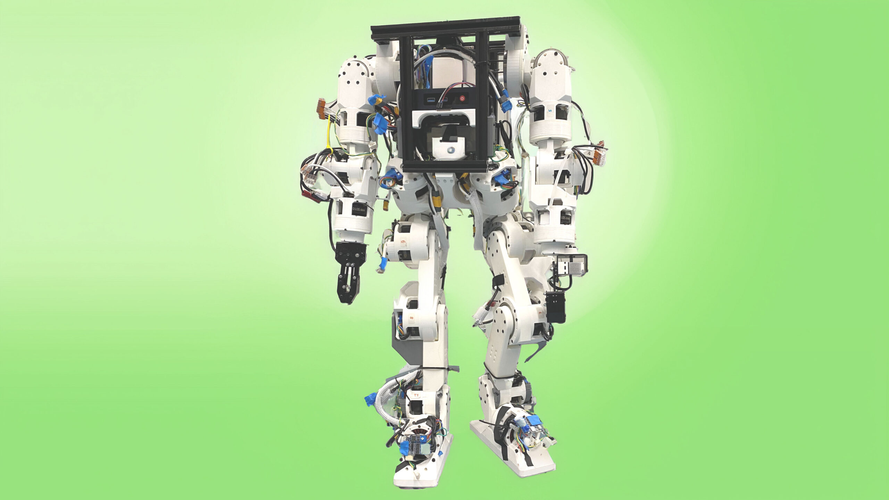
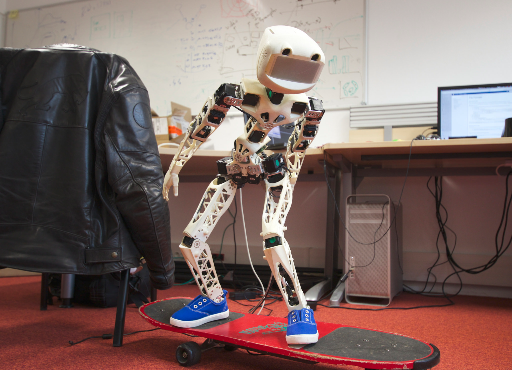
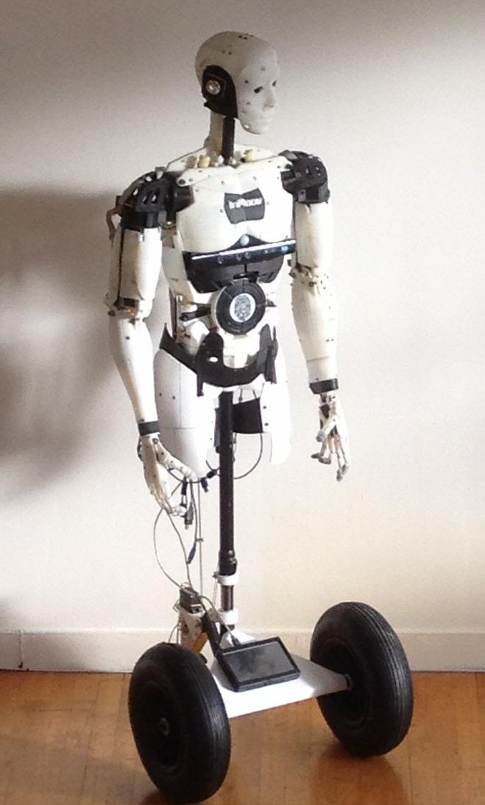
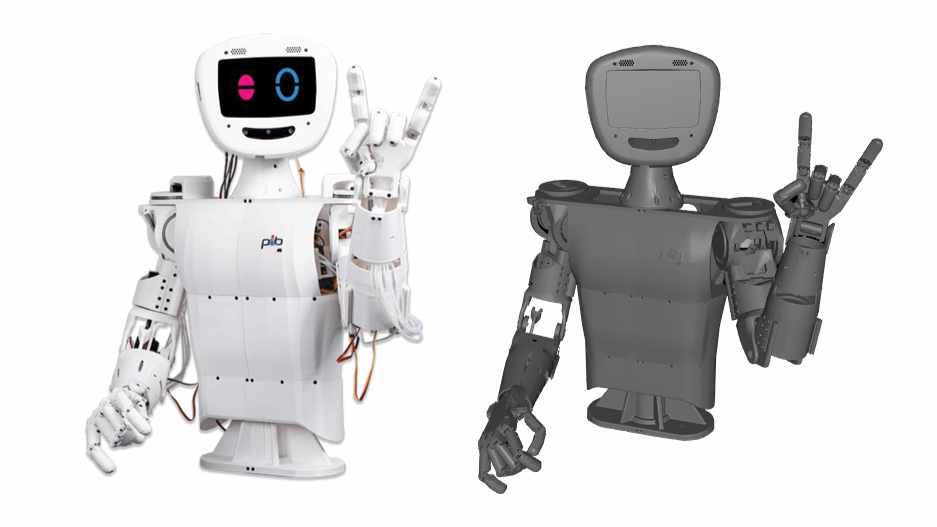
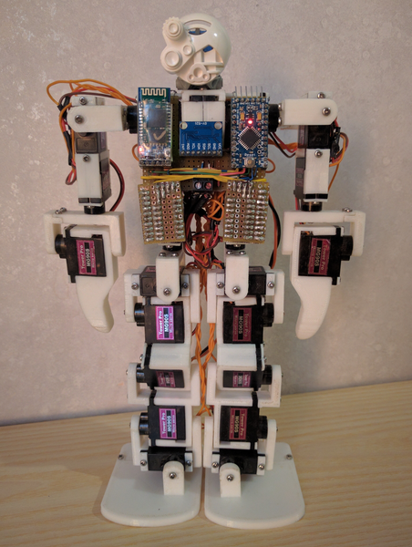

# 🤖 Open-Source Humanoid Robots Repository

Welcome to the ultimate guide to open-source humanoid robotics! This repository is a curated collection of buildable, open-source humanoid robots that are perfect for hobbyists, researchers, and students. Our mission is to lower the barrier to entry into the fascinating world of humanoid robotics by centralizing the information you need to get started.

Each robot featured here includes a detailed summary, key features, and direct links to the official documentation, 3D models, and software repositories. Let's start building the future of robotics, one open-source project at a time.

## About Me

I am currently pursuing a PhD in Computer Science with a specialization in robotics, focusing on robotic arms and humanoid robots. As part of my exploration, I have curated this list of open-source humanoid robots. I have personally built the **SO-101** robotic arm and am now moving towards applying imitation learning and other advanced techniques on it. Additionally, now I have ordered material for building my **first humanoid robots** by hands. 

---

## [Featured Robots](https://www.linkedin.com/in/zaid-mahboob/)

## 1. Berkeley Humanoid Lite Robot
- **Creator**: The Hybrid Robotics Group at the University of California, Berkeley.
- **Degree of Freedom**: Designed to support agile bipedal locomotion, whole-body control, and manipulation tasks, offering a high degree of freedom.
- **Estimated Cost**: **Under $5,000**.
- **Key Features**:
  - **Academic-Grade Research Platform**: Developed by a leading research institution, making it ideal for advanced robotics and AI research.
  - **3D-Printed**: The entire robot, including its robust, modular gearboxes, is designed to be fabricated using a standard desktop 3D printer.
  - **Open-Source Stack**: Provides all necessary hardware designs, embedded code, and machine learning training frameworks.
  - **Minimal Sim-to-Real Gap**: Optimized for reinforcement learning, allowing for seamless transition from simulated training to real-world deployment.
- **Documentation**:
  - [Official Website & Documentation](https://berkeley-humanoid.org/)
- **Images**:
  - 

---

## 2. Poppy Humanoid Robot
- **Creator**: The Poppy Project Team, a collaboration initiated by Inria.
- **Degree of Freedom**: **25 Degrees of Freedom** (DOF) for the full humanoid.
- **Estimated Cost**: **$8,000 - $9,000**.
- **Key Features**:
  - **Modular and Parametric**: The robot's design is flexible and highly customizable, allowing users to build a variety of configurations.
  - **Integrated Software Ecosystem**: Powered by a user-friendly Python library (**Pypot**), making it easy to program and integrate with simulators.
  - **Community-Focused**: Fosters a large, active community of developers, artists, and educators who share their creations and knowledge.
  - **Educational Focus**: A popular platform in schools and universities for teaching robotics, control, and human-robot interaction.
- **Files**:
  - [Link to 3D printable models](https://github.com/poppy-project/poppy-humanoid)
  - [Link to software repository](https://github.com/poppy-project/pypot)
- **Documentation**:
  - [Official Documentation](https://docs.poppy-project.org/)
- **Images**:
  - 

---

## 3. InMoov
- **Creator**: Gaël Langevin.
- **Degree of Freedom**: **20+ DOF**, with a modular design that can be expanded.
- **Estimated Cost**: The cost of components can range from hundreds to thousands of dollars depending on the quality of servos and other electronics.
- **Key Features**:
  - **Life-Sized and Fully 3D-Printable**: A landmark project that allows you to build a full-scale humanoid robot with a standard desktop 3D printer.
  - **Modular Design**: Build the robot in sections (a hand, an arm, a head, etc.), making the project manageable and scalable.
  - **Extensive Community Support**: Backed by a massive, active community of makers who provide support, share tips, and showcase their unique builds.
  - **Integrated with MyRobotLab**: Leverages a powerful open-source framework for advanced features like voice recognition and object tracking.
- **Files**:
  - [Link to software repository](https://github.com/MyRobotLab/inmoov)
- **Documentation**:
  - [Official Website & Documentation](http://inmoov.fr/)
- **Images**:
  - 

---

## 4. P-I-B (Printable Intelligent Bot)
- **Creator**: Jürgen Baier and the pib.rocks team.
- **Degree of Freedom**: The full, current version of the robot can control up to **30 motors**, providing a high degree of freedom for complex interactions and movements.
- **Estimated Cost**: The non-printable parts (motors, electronics) can be purchased in kits or sourced individually. A full kit can range from **$400 to $600**, making it a very cost-effective option for a full-featured humanoid.
- **Key Features**:
  - **Educational Focus**: Designed as a learning tool for students and hobbyists to engage with robotics, AI, and 3D printing.
  - **Highly Interactive**: Equipped with a camera, microphones, and a display to enable features like gesture recognition, voice commands, and expressive animations.
  - **Modular and 3D-Printable**: The entire robot can be fabricated using a standard 3D printer, with all files and instructions freely available.
  - **Active Community**: Supported by a large and growing community on Discord, where builders can share progress and get assistance.
- **Files**:
  - [Link to 3D printable models](https://pib.rocks/print/)
  - [Link to assembly instructions](https://pib.rocks/build/)
  - [Link to software repository](https://pib.rocks/research-and-development/)
- **Documentation**:
  - [Official Website & Documentation](https://pib.rocks/)
- **Images**:
  - 

---

## 5. RoboPrime
- **Creator**: Simone Primarosa.
- **Degree of Freedom**: **21 Degrees of Freedom** (DOF).
- **Estimated Cost**: **$60 - $100**.
- **Key Features**:
  - **Ultra-Affordable**: One of the most cost-effective humanoid robot projects available, making it accessible to virtually anyone.
  - **Beginner-Friendly**: Uses a common Arduino-compatible microcontroller (ATmega328P), making it an excellent starting point for learning electronics and coding.
  - **Bluetooth Control**: Easily programmable and controllable via a Bluetooth connection, ideal for basic experimentation with movements and animations.
- **Documentation**:
  - [GitHub Repository](https://github.com/simonepri/roboprime)
- **Images**:
  - 

---

## 📌 **Acknowledgements**

I acknowledge that ChatGPT was used for formatting and better presentation of the content. All the images and content shown on this page is copied from their original sources which are linked with each humanoid.

---

### 📌 **Contribution**

Found another amazing open-source humanoid robot? Have a suggestion for an existing entry? We welcome contributions! Please feel free to open a pull request or create an issue. Let's make this the most comprehensive and useful resource for DIY robotics enthusiasts.